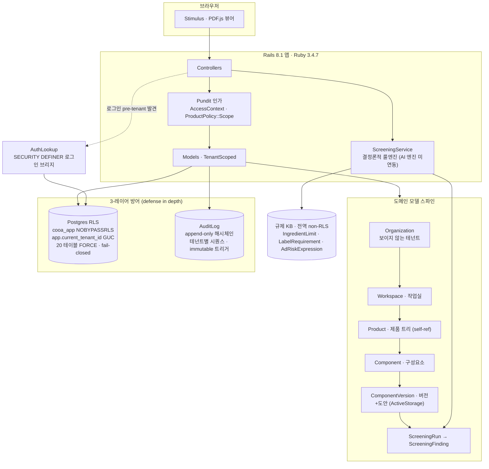
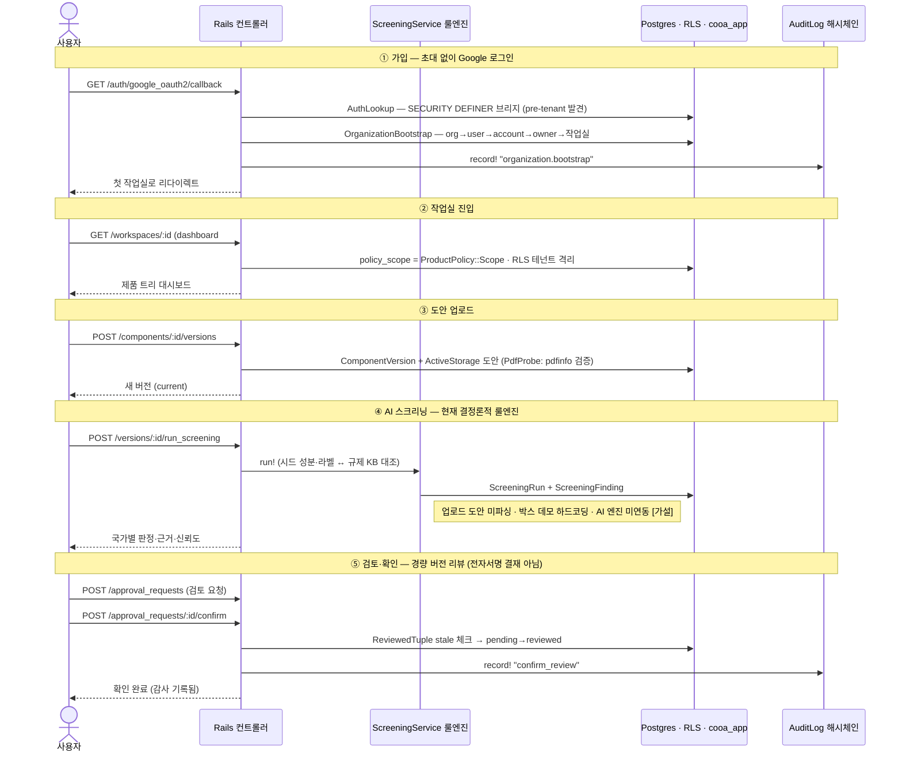

# COOA (web)

**COOA = 화장품 패키징 도안의 AI 규제 사전검토 엔진 + 검토·협업 워크스페이스** (JP·CN·US·B2B).
수출 브랜드가 도안(패키징 아트워크)의 국가별 규제 적합성을 이메일 핑퐁·외부 컨설팅·수작업 대조로 확인하는
반복 루프를 없애는 것이 목표다. **편집기가 아니다** — 도안 제작은 외부(피그마·일러스트레이터)에서 하고,
COOA는 **검토·판단·기록**을 소유한다.

제품은 두 축이다:
- **(A) AI 검토 엔진** — 도안을 JP/CN/US 규제 대비 사전 스크리닝.
- **(B) 협업 워크스페이스** — 작업실 단위로 도안 버전을 올리고·검토하고·확인하는 공간.

> ### ⚠️ 지금 무엇이 진짜인가 (정직 상태 — 2026-07 기준)
> 이 리포는 **(B) 협업 워크스페이스**를 구현한 것이다(가입·작업실·업로드·경량 리뷰·감사 — 테스트 386 + 시스템 46).
> **(A) AI 검토 엔진은 아직 미구축**이다. 현재 `app/services/screening_service.rb`는 **결정론적 룰엔진**(코드
> 주석 그대로 "LLM 없이")으로, 업로드된 도안을 **파싱하지 않고** 시드된 성분/라벨 행을 규제 KB와 대조한다.
> Finding의 바운딩 박스는 데모 아트워크용 **하드코딩 좌표**다. 이 경계를 알고 코드를 읽어라.
> 제품 정본은 vault의 `PRD-COOA` (§① 2축, §③ 유저 저니, `[사실]`/`[가설]` 스탬프).

이 문서는 **개발자용 30분 온보딩**이다. 제품·개념 서사 온보딩은 vault `제품/온보딩-COOA-30분.md`를 보라.

---

## 아키텍처 (시스템 구성)

브라우저 → Rails 8.1 → 도메인 모델 스파인, 그리고 **3-레이어 방어**(RLS · Pundit · 감사).



**3-레이어 방어를 한 문단으로**: 모든 도메인 테이블은 Postgres **RLS**로 테넌트 격리된다 — 앱 런타임은
`cooa_app`(NOBYPASSRLS) 역할로 접속하므로 RLS가 실제로 강제되고, 테넌트 GUC(`app.current_tenant_id`)가
미설정이면 쿼리는 전체 테이블이 아니라 **0행(fail-closed)** 을 본다. 그 위에 **Pundit**가 앱 레벨 인가(역할·스코프)를
얹고, 모든 판정(allow/deny)은 **append-only 해시체인 감사 로그**에 남는다. 로그인 시점엔 아직 테넌트가 정해지지
않으므로, 검증된 신원이 어느 테넌트 소속인지 찾는 `auth_lookup_*`만 `SECURITY DEFINER`로 이 격리를 건넌다.

전체 물리 ERD(도메인 모델 24개·복합 FK·전 29 테이블)는 인라인으로 두기엔 너무 크다 → **Miro ERD 보드**: <https://miro.com/app/board/uXjVHBiCz2I=/>

---

## 유저 저니

가입 → 작업실 진입 → 도안 업로드 → AI 스크리닝 → 검토·확인 → 감사.



각 스텝의 실제 코드 진입점:

| # | 스텝 | 컨트롤러/서비스 |
|---|---|---|
| ① | 가입·조직 부트스트랩 | `sessions_controller.rb#omniauth_callback` → `services/organization_bootstrap.rb` |
| ② | 작업실 진입/생성 | `dashboard_controller.rb#index` · `workspaces_controller.rb` |
| ③ | 도안 업로드 | `component_versions_controller.rb#create` · `services/pdf_probe.rb` |
| ④ | 스크리닝(룰엔진) | `screenings_controller.rb#run_screening` → `services/screening_service.rb` |
| ⑤ | 검토·확인 | `approval_requests_controller.rb#create,#confirm` · `services/reviewed_tuple.rb` |
| 감사 | 쓰기마다 명시 호출 | `models/audit_log.rb#record!` + `lib/audit_log_hash.rb` |

---

## 로컬에서 돌리기

**사전 요구**: Ruby 3.4.7 · PostgreSQL · (선택) poppler `pdfinfo` — 업로드 PDF 무결성 검증에 쓰임(없으면 검증 skip).

```sh
bin/setup          # 멱등: bundle → git 훅(lefthook) → db:prepare → cooa_app 권한 부여 → bin/dev 기동
bin/setup --reset  # DB 를 초기화하고 재구성
bin/dev            # 개발 서버만 (foreman → http://localhost:3000 + tailwind watch)
```

`bin/setup`은 마지막에 `bin/dev`를 exec 한다(`--skip-server`로 생략 가능).

### 꼭 알아야 할 함정 (`docs/dev-discipline.md` R1~R9 요약)

- **런타임 vs owner 역할**: 앱은 `cooa_app`(NOBYPASSRLS)로 접속해 RLS가 강제된다. **마이그레이션·시드·grant는
  owner로** 실행해야 한다 — `COOA_DB_USER=$USER bin/rails db:migrate` 처럼. (`config/database.yml:12-15`.
  최초 1회 `cooa_app` 역할이 없으면 생성 필요 — SQL은 `docs/prod-cutover.md §3`.)
- **컬럼 마이그레이션 후엔 web 재시작 + schema_cache 재덤프** (`R1`/`R6`): stale 인메모리 schema_cache가
  "테스트는 그린인데 앱은 깨짐"을 만든다. `COOA_DB_USER=$USER bin/rails db:schema:cache:dump` 후 커밋.
- **`db:migrate db:seed`를 한 줄로 체이닝하지 말 것** — 마이그 후 프로세스를 새로 띄워라.
- **새 테이블·쓰기 경로를 추가하면** `lib/tasks/cooa.rake`의 grant 그룹에 분류하고 `rls:grant_app` 재실행
  (`R8`). 안 하면 `cooa_app`에서 `PG::InsufficientPrivilege` 500. `rls:grant_audit`가 미분류 테이블에서 실패한다.
- 절대 AR 객체를 프로세스/클래스 레벨에 캐시하지 말 것(`R7` — 테넌트 누수·RLS 우회 위험).

### 테스트 · 게이트

```sh
PARALLEL_WORKERS=1 bin/rails test        # 유닛/통합/컨트롤러/모델/폴리시 (owner + test DB)
PARALLEL_WORKERS=1 bin/rails test:all    # 위 + 시스템(Playwright) — test:system 은 `test`에 없음(은폐 주의)
bin/smoke                                # DoD: 실앱을 cooa_app 으로 부팅 + GET 크리티컬 경로
SMOKE_REQUIRE_WRITE=1 bin/smoke          # + 쓰기 왕복(업로드→미리보기→cascade 삭제→잔여 0)
bin/ci                                   # 전체 게이트 (pre-push 가 이걸 발화):
                                         #   rubocop → 보안 3종 → rls:audit/grant_audit/verify(owner)
                                         #   → rails test → seed → test:system → smoke
```

- **`PARALLEL_WORKERS=1`은 필수** — macOS 에서 parallel fork 가 pg 드라이버를 segfault 낸다.
- **`test:system`은 `bin/rails test`에 포함되지 않는다** — `test:all`로 돌려야 은폐되지 않는다.
- **DoD = `bin/smoke` 그린 + 수동 클릭스루** (테스트 그린만으로는 "앱 작동"이 아니다).

---

## 규율 · 더 읽을거리

이 리포의 규율은 문서가 진실원천이다(내용 복제 금지 — `CLAUDE.md`는 포인터만):

- `docs/dev-discipline.md` — 개발 검증 규율 R1~R9 · `bin/smoke` = DoD · RLS grant 규율.
- `docs/harness.md` — 무엇이 어디서 강제되나(lefthook · strong_migrations · P0 git 토폴로지 가드 · pre-push→`bin/ci`).
- `docs/prod-cutover.md` — 프로덕션 컷오버 런북(`cooa_app` 역할 생성 · `bin/release-migrate` · `bin/audit-scan`).
- `docs/e2e-testing.md` — Playwright 시스템 테스트 · 로그인 헬퍼.
- **git 토폴로지 안전**: 상위 `../CLAUDE.md` — 중첩 2-repo, **outer 를 web-demo 로 push 금지**.

제품·전략·규제 데이터 등 코드 밖 지식은 Obsidian vault(`../cooa_obsidian/`):
제품 정본 `PRD-COOA`, 개념 온보딩 `제품/온보딩-COOA-30분.md`, 기술 결정 `ADR-001/002/003`.
