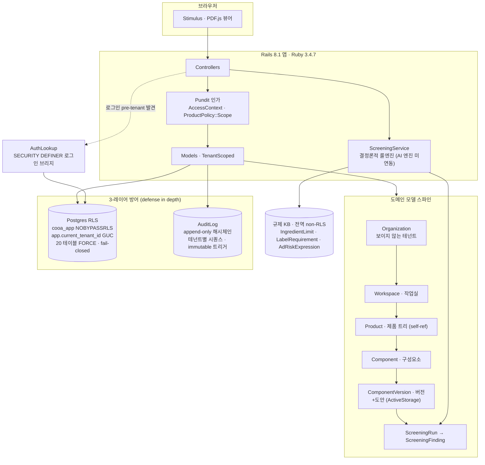
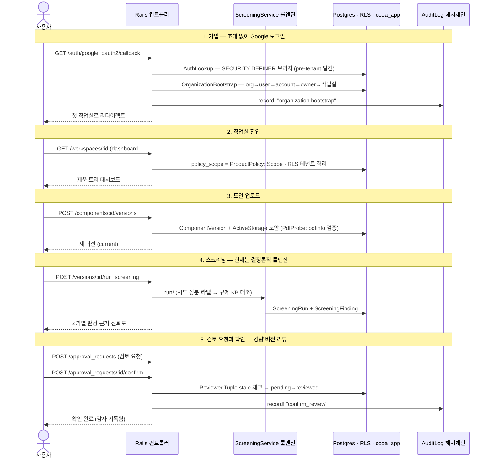
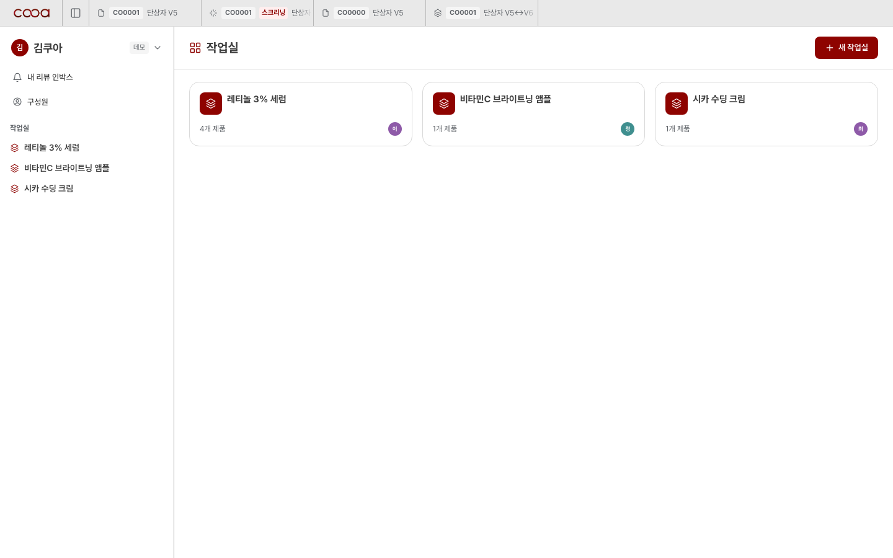
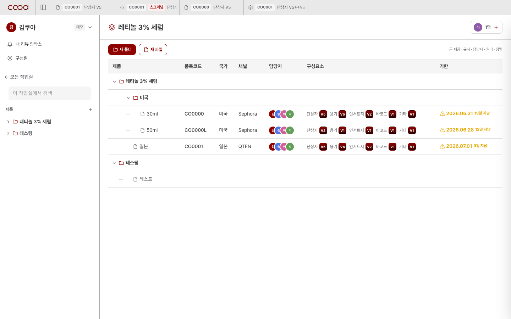
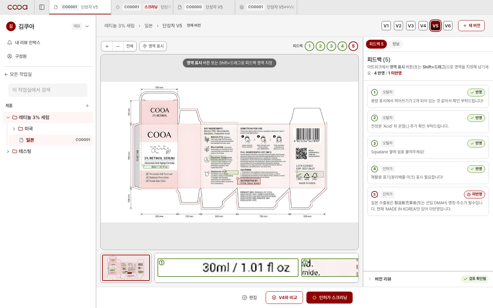
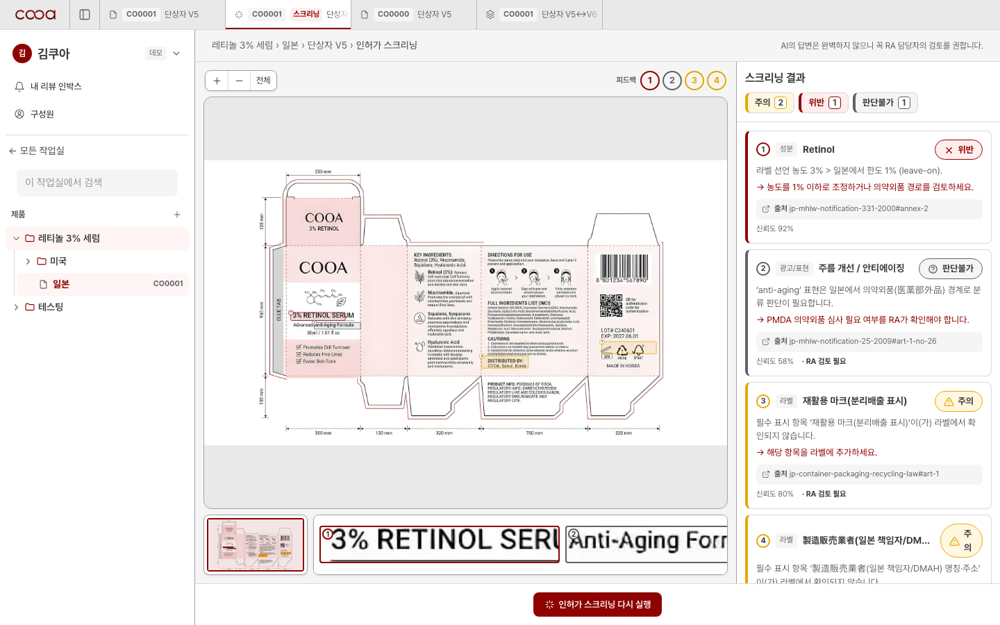
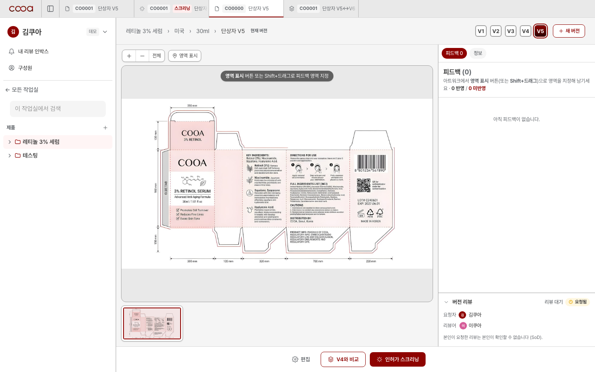
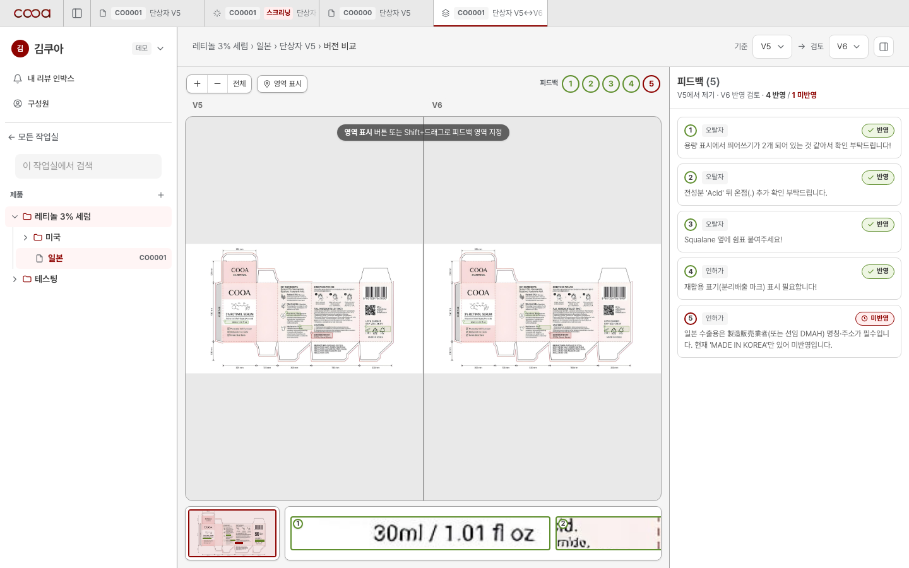

# COOA

[](https://github.com/GangWooLee/cooa-web/actions/workflows/ci.yml)

화장품 패키징 도안의 규제 사전검토와 검토 협업을 담는 B2B 워크스페이스입니다.
Rails 8.1, PostgreSQL 17(Row-Level Security), Hotwire로 만들었습니다.

## 문제

수출 화장품 브랜드는 패키징 도안 하나를 확정하기까지 국가별 규제 적합성을 사람 손으로 확인합니다.
성분 함량 제한, 광고 표현 규제, 라벨 필수 항목이 일본, 중국, 미국마다 다르고,
확인 결과는 이메일과 메신저로 오가며 수정 라운드가 반복됩니다.
실제 인터뷰에서 문안 수정 15차, 출시 3주 지연, 이전 버전에 수정을 반영하는 누락 사고 같은 사례를 확인했습니다.
도안 폐기와 재인쇄 비용보다 큰 손실은 출시 지연입니다.

## 제품 컨셉

COOA는 이 반복 루프를 두 축으로 줄입니다.

- 검토 엔진: 도안을 국가별 규제 지식베이스와 대조해 위반 후보를 사전에 찾아냅니다.
- 협업 워크스페이스: 작업실 단위로 도안 버전을 올리고, 영역 피드백을 달고, 검토를 확인하고, 그 전부를 감사 기록으로 남깁니다.

편집기가 아닙니다. 도안 제작은 피그마와 일러스트레이터에서 하고, COOA는 검토와 판단과 기록을 맡습니다.

> **현재 상태를 정직하게 적습니다.**
> 이 저장소가 구현한 것은 협업 워크스페이스 축입니다. 가입, 작업실, 업로드, 스크리닝 화면, 경량 리뷰, 감사까지 동작합니다.
> AI 검토 엔진은 아직 만들지 않았습니다. 현재 `app/services/screening_service.rb`는 LLM 없이 동작하는 결정론적 룰엔진이고,
> 업로드된 도안 파일을 파싱하지 않으며(시드된 성분과 라벨 데이터를 규제 지식베이스와 대조), 위반 영역 표시 좌표는 데모 도안에 맞춘 하드코딩입니다.
> 이 경계를 아는 것이 이 저장소를 읽는 출발점입니다.

## 아키텍처

브라우저에서 Rails, 도메인 모델, 그리고 3개 방어 레이어(RLS, Pundit, 감사 체인)로 이어지는 구조입니다.



사용자 저니는 가입부터 감사 기록까지 하나의 흐름입니다.



전체 물리 스키마는 도메인 모델 24개, 테이블 29개 규모입니다.

## 보안 설계가 왜 이렇게 생겼는가

이 앱이 다루는 데이터는 출시 전 도안입니다. 다른 회사에 보이면 안 되고, 검토 기록은 나중에 부정될 수 없어야 합니다.
그래서 격리와 기록을 애플리케이션 코드가 아니라 가능한 한 데이터베이스가 강제하도록 설계했습니다.

**테넌트 격리는 Postgres RLS가 맡습니다.** 20개 테이블에 ENABLE과 FORCE로 정책을 걸고,
앱 런타임은 BYPASSRLS가 없는 `cooa_app` 역할로만 접속합니다.
테넌트 식별자는 트랜잭션 스코프 GUC(`app.current_tenant_id`)로 주입하고,
미설정이면 쿼리는 전체 테이블이 아니라 0행을 봅니다. 코드에 버그가 있어도 남의 데이터가 열리는 방향이 아니라 닫히는 방향으로 실패합니다.
부모 자식 관계는 전부 복합 외래키 `(tenant_id, id)`라서 교차 테넌트 참조는 스키마 수준에서 성립하지 않습니다.

**감사 로그는 append-only 해시체인입니다.** 테넌트별 시퀀스와 이전 행 해시를 엮어 SHA-256 체인을 만들고,
DB 트리거가 UPDATE와 DELETE를 거부합니다. `cooa_app`에는 애초에 그 권한을 주지 않습니다.
행 하나를 몰래 고치면 이후 체인 전체가 깨지므로, 검증 태스크(`audit:verify`)가 변조를 찾아냅니다.

**앱 레벨 인가는 Pundit이 맡습니다.** 8개 역할과 동사 권한표(PermissionMatrix)를 두고,
모든 컨트롤러 액션에 `verify_authorized`를 강제합니다.
검토 확인에는 직무 분리(SoD)를 겁니다. 요청자는 자기 요청을 확인할 수 없습니다.

로그인 시점에는 아직 테넌트가 정해지지 않았다는 문제가 남는데,
검증된 신원이 어느 테넌트 소속인지 찾는 두 개의 `SECURITY DEFINER` 함수만 이 격리를 건너도록 허용했습니다.
이 함수의 소유자 조건까지 배포 런북의 게이트로 문서화했습니다(`docs/prod-cutover.md`).

## 테스트 전략

테스트는 피라미드로 쌓았습니다. 전체 475개이며 GitHub Actions에서 매 push마다 돕니다.

- 인가 매트릭스: 8개 역할 x 23개 엔드포인트의 HTTP 결과가 권한표와 일치하는지 통합 테스트가 전수 대조합니다(어서션 330).
  기대값을 손으로 쓰지 않고 권한표에서 도출하므로, 컨트롤러에서 authorize가 빠지는 fail-open을 자동으로 잡습니다.
  실제로 authorize 한 줄을 제거하는 뮤테이션을 주입해 테스트가 실패하는 것을 확인한 뒤 채택했습니다.
- 페르소나 저니: 8개 역할 각각이 가입부터 검토 확인까지 상태가 이어지는 체인을 통과하는 통합 테스트 8종.
- 시스템 테스트: Playwright 실브라우저 48개. 드래그, PDF 뷰어, 리뷰 라운드트립처럼 JS가 필요한 구간만 담당합니다.
- 스모크: 테스트 그린과 별개로, 실제 앱을 `cooa_app` 권한으로 부팅해 업로드부터 삭제까지 쓰기 왕복을 확인하는 `bin/smoke`를 완료 기준으로 씁니다.
  테스트는 owner 권한으로 돌기 때문에 권한 결함을 못 보는 사각지대가 있고, 실제로 이 사각지대에서 나온 업로드 500 장애를 겪은 뒤 만든 장치입니다.

## 화면

| | |
|---|---|
|  |  |
| 작업실 목록 | 작업실 안 제품 트리 |
|  |  |
| 버전 상세, 도안 뷰어와 영역 피드백 | 국가별 스크리닝 판정 |
|  |  |
| 검토 요청과 확인 | 버전 간 비교 |

## 로컬에서 실행

```sh
bin/setup   # bundle, DB 준비, 권한 부여까지 멱등으로 처리한 뒤 서버를 띄운다
```

Ruby 3.4.7과 PostgreSQL 17이 필요합니다. 자세한 실행 방법과 개발 규율은 [docs/onboarding-dev.md](docs/onboarding-dev.md)에 있습니다.

## 배운 것과 한계

- 멀티테넌시를 DB가 강제하게 하면 애플리케이션 버그의 폭발 반경이 줄어드는 대신, 운영 규율이 늘어납니다.
  structure.sql이 GRANT를 지우기 때문에 스키마를 다시 적재할 때마다 권한을 재부여해야 하고,
  owner로만 검증하면 런타임 권한 결함이 안 보입니다. 이 함정들을 훅과 감사 태스크로 기계화했습니다(`docs/harness.md`).
- 테스트 그린과 앱 동작은 다릅니다. stale schema cache, 권한 미부여, 예약 키 충돌처럼
  테스트 하네스에서는 재현되지 않는 장애를 여러 번 겪었고, 그때마다 검증 규율(R1~R9)에 항목을 추가했습니다.
- 가장 큰 한계는 이름에 걸린 검토 엔진이 아직 룰 매칭이라는 점입니다. 도안 파일에서 텍스트를 뽑는 파이프라인과
  LLM 하이브리드 판정이 없으면 이 제품의 핵심 가설은 검증되지 않은 상태로 남습니다. 아래 로드맵의 1순위입니다.

## 로드맵

배포 운영 대신 다음 고도화에 우선순위를 둡니다.

1. 검토 엔진 최소판: 한 국가(일본)부터 규제 지식베이스와 LLM을 결합한 하이브리드 판정을 실연동합니다.
2. 도안 텍스트 추출: 업로드된 PDF에서 성분표와 라벨 문안을 추출해 스크리닝 입력을 시드가 아니라 실제 파일로 바꿉니다.
3. 성능 문서화: RLS 오버헤드와 N+1 게이트(bullet, prosopite) 수치를 벤치마크로 남깁니다.

## 저장소에 관하여

이 저장소는 포트폴리오 공개용입니다. 제품 기획과 규제 데이터셋은 별도 비공개 저장소에서 관리합니다.
커밋 트레일러에 남아 있듯 개발 과정에서 Claude를 함께 썼습니다.
